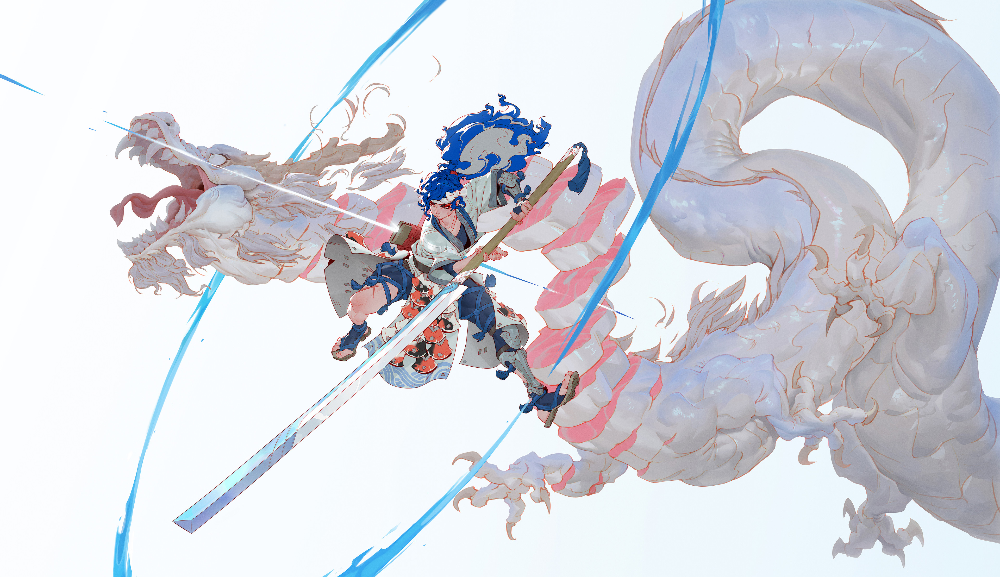

# rwal: pywal replacemnt/rewrite/port in rust

```
Usage: rwal [OPTIONS] <FILE_PATH>

Arguments:
  <FILE_PATH>

Options:
  -b, --backend <BACKEND>              [default: median-cut] [possible values: simple, wal, median-cut]
  -p, --patterns <PATTERNS>            [default: brightness] [possible values: brightness, random, bg-fg-rest, gray-scale-first]
  -c, --colors <COLORS>                [default: 16]
  -t, --test
  -t, --templates-dir <TEMPLATES_DIR>
  -c, --cache-dir <CACHE_DIR>
  -h, --help                           Print help
  -V, --version                        Print version
```

This project is WIP, so many things can change quickly.  
I'm learning rust, so any criticism/PRs are welcome.

## Arguments

`-b, --backend <BACKEND>` currently there are 3 backends available: wal (imagemagick), modified median-cut and simple.  
`simple` is useless. It was implemented just for initial testing. May be removed later.  
`wal` is wal. Code initially was stolen from rswal, another pywal rust port.  
`median-cut` is median-cut but with different logic for selecting buckets to cut (not a proven-good-algorithm, just my experiments and whiteboarding.)

`-p, --patterns <PATTERNS>` these determine in which order final colors will be represented.  
`brightness` orders colors in order of their _perceived_ brightness, from dark to light.  
`random` welp...  
`bg-fg-rest` puts darkest color in first place, then puts lightest color. The rest is put after that, not changing any order (apart from darkest and lightest color beign pulled from the sequence).  
`gray-scale-first` orders colors in order of their _gray-scale-ness_. (their distance from being gray)  
**These can be chained, like** `-p brightness,bg-fg-rest`. They will be applied in specified order.

`-c, --colors <COLORS>` number of colors to produce. can be in a range from 1 to 256. On high color counts some backends may break from color count in an image.

## Examples:


wal (imagemagick)

median-cut


wal (imagemagick)

median-cut



wal (imagemagick)

median-cut


wal (imagemagick)

median-cut


wal (imagemagick)

median-cut

